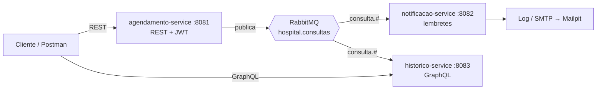

# Hospital Scheduling — Tech Challenge Fase 3

Sistema de agendamento e histórico de consultas hospitalares, construído como backend modular com foco em **segurança** e **comunicação assíncrona**.

> FIAP Pós Tech — Arquitetura e Desenvolvimento Java · Fase 03
> Autor: Gabriel Andrade Almeida

---

## Status

🚧 Em desenvolvimento. Acompanhe o [roadmap](docs/04-roadmap.md).

## Arquitetura em uma frase

Três serviços Spring Boot — **agendamento** (escrita, REST, Clean Architecture), **notificações** (lembretes) e **histórico** (leitura, GraphQL) — integrados por eventos no **RabbitMQ**, com autenticação JWT e autorização por perfil.



## Stack

Java 21 · Spring Boot 3.5 · Spring Security + JWT · Spring for GraphQL · Spring AMQP + RabbitMQ · PostgreSQL 16 + Flyway · Testcontainers · ArchUnit · JaCoCo · Docker Compose

## Documentação

| Documento | Conteúdo |
|---|---|
| [Project Charter](docs/00-project-charter.md) | Escopo, papéis, decisões, Definition of Done |
| [Arquitetura](docs/01-arquitetura.md) | Visão geral, estrutura, Clean Architecture, segurança |
| [Especificação Funcional](docs/02-especificacao-funcional.md) | RF/RNF rastreáveis, matriz de autorização, modelo de dados |
| [Contrato de Eventos](docs/03-contrato-de-eventos.md) | Topologia RabbitMQ, envelope, outbox, idempotência |
| [Roadmap](docs/04-roadmap.md) | 15 changes com escopo, notas técnicas e critérios de aceite |
| [Fluxo de Trabalho](docs/05-fluxo-de-trabalho.md) | Ciclo OpenSpec + GitFlow, releases, convenção de commits |
| [ADRs](docs/adr/) | Decisões arquiteturais |
| [`openspec/config.yaml`](openspec/config.yaml) | Contexto e regras injetados em todo planejamento OpenSpec |
| [`openspec/specs/`](openspec/specs/) | O que já está construído, por capability |
| [`openspec/changes/`](openspec/changes/) | Propostas em andamento |

## Construir o projeto

Requisitos: **JDK 21** e **Maven 3.9+**.

```bash
mvn clean verify
```

O POM pai centraliza a versão de todos os módulos na propriedade `revision` — subir a versão
do projeto inteiro é alterar uma linha. O `flatten-maven-plugin` resolve esse placeholder nos
POMs publicados, gerando um `.flattened-pom.xml` por módulo (ignorado pelo Git).

Testes são separados por convenção de nome:

| Comando | O que roda |
|---|---|
| `mvn test` | apenas `*Test.java` (surefire) — unitários, rápidos, sem container |
| `mvn verify` | `*Test.java` **e** `*IT.java` (failsafe) — inclui integração com Testcontainers |

## Executar a infraestrutura

Sobe PostgreSQL 16 e RabbitMQ 3.13, que é tudo que os serviços precisam para rodar localmente.
Os containers das três aplicações entram no M12.

```bash
cp .env.example .env
docker compose up -d
```

Aguarde os dois containers ficarem `healthy`:

```bash
docker compose ps
```

| Recurso | Endereço | Credenciais padrão |
|---|---|---|
| PostgreSQL | `localhost:5432` | `hospital` / `hospital` |
| RabbitMQ (AMQP) | `localhost:5672` | `hospital` / `hospital` |
| RabbitMQ Management | http://localhost:15672 | `hospital` / `hospital` |

Portas e credenciais vêm do `.env` — se a 5432 ou a 5672 já estiverem ocupadas na sua máquina,
altere `POSTGRES_PORT` / `RABBITMQ_PORT` ali, sem tocar no `docker-compose.yml`.

### ⚠️ O `init.sql` só roda com o volume vazio

Os três databases — `agendamento_db`, `notificacao_db` e `historico_db` — são criados por
[`docker/postgres/init.sql`](docker/postgres/init.sql), montado em `/docker-entrypoint-initdb.d/`.

O entrypoint do Postgres **só executa esse diretório quando o volume de dados está vazio**.
Depois do primeiro boot, editar o `init.sql` não tem efeito nenhum: um `docker compose restart`
ou um `docker compose down` seguido de `up` reaproveitam o volume e ignoram o script.

Para reprovisionar do zero é preciso descartar o volume:

```bash
docker compose down -v && docker compose up -d
```

O `-v` é a diferença entre "reiniciei o ambiente" e "recriei o ambiente". Sem ele, uma alteração
no `init.sql` fica invisível e rende uma hora de depuração à toa.

Conferir que os três databases existem:

```bash
docker exec hospital-postgres psql -U hospital -d postgres -c "\l"
```

### Derrubar

```bash
docker compose down      # para os containers, preserva os dados
docker compose down -v   # remove também os volumes — apaga tudo
```

## Executar o serviço de agendamento

Com a infraestrutura no ar e o `.env` preenchido:

```bash
mvn -pl agendamento-service -am spring-boot:run
```

O schema do `agendamento_db` é criado pelo **Flyway**, nunca pelo Hibernate: o
`ddl-auto` está em `validate`, então a aplicação confere o mapeamento contra o banco
e **recusa subir** se divergirem.

### Quando a subida falha por schema divergente

`SchemaManagementException` ou falha de validação do Flyway significa que o banco está
num estado que as migrations não descrevem — quase sempre por ter sido criado por uma
versão anterior do schema. Como não há dado que importe até o M04, o caminho é
recriar:

```bash
docker compose down -v && docker compose up -d
```

Alterar uma migration já aplicada **não** resolve: o Flyway compara o checksum e falha
de novo. Migration aplicada é imutável; correção é migration nova.

### Testes de integração

Os testes `*IT` sobem um PostgreSQL real via Testcontainers e exigem Docker no ar:

```bash
mvn verify
```

Se o Testcontainers não encontrar o Docker mesmo com o daemon rodando, verifique se
`~/.testcontainers.properties` não fixa uma `docker.client.strategy` apontando para um
endpoint que a sua instalação não expõe — remover essa linha faz o Testcontainers
autodescobrir de novo.

## Usar a API

Com o serviço no ar, a documentação interativa fica em **http://localhost:8081/swagger-ui.html**,
e a especificação em `/v3/api-docs`.

| Endpoint | Método | O que faz |
|---|---|---|
| `/api/v1/consultas` | POST | Registra uma consulta. Responde `201` com `Location` |
| `/api/v1/consultas/{id}` | PUT | Altera. **Campo ausente preserva o valor atual** |
| `/api/v1/consultas/{id}/confirmar` | PATCH | Leva a consulta a `CONFIRMADA` |
| `/api/v1/consultas/{id}/cancelar` | PATCH | Cancela, com motivo obrigatório |
| `/api/v1/consultas/{id}` | GET | Recupera pelo identificador |
| `/api/v1/consultas` | GET | Lista paginado, com filtros opcionais |

A listagem aceita `pacienteId`, `medicoId`, `status`, `de`, `ate`, `pagina` e `tamanho`.
O tamanho de página tem **teto de 100**: um pedido maior é aparado, não recusado, e o
campo `tamanho` da resposta informa o valor aplicado.

Erros seguem RFC 7807, com `correlationId` e `timestamp`. Enviar `X-Correlation-Id` na
requisição preserva o seu identificador na resposta e no log.

### Autenticação

Todos os endpoints sob `/api/**` exigem um token. São públicos apenas `POST /auth/login`,
`/actuator/health`, `/v3/api-docs` e o Swagger UI. Qualquer outro caminho é negado por
padrão — rota nova que ninguém liberou fica inacessível, o que é falha visível em vez de
brecha.

```bash
curl -s -X POST http://localhost:8081/auth/login \
  -H 'Content-Type: application/json' \
  -d '{"email":"medico@hospital.com","senha":"Senha@123"}'
```

A resposta traz `token`, `expiraEmSegundos` e `perfil`. Use o token como `Bearer` nas
demais chamadas:

```bash
curl -s http://localhost:8081/api/v1/consultas \
  -H "Authorization: Bearer $TOKEN"
```

No Swagger UI, o botão **Authorize** aceita o token e o aplica a todas as operações.

O segredo de assinatura vem de `JWT_SECRET`, lido do ambiente. A aplicação **não sobe**
com o segredo ausente ou com menos de 32 bytes — falha na partida em vez de assinatura
fraca em produção. O token vale 8 horas e não é revogável; o porquê está em
[ADR-005](docs/adr/ADR-005-jwt-stateless.md).

### Quem pode o quê

| Endpoint | Método | MEDICO | ENFERMEIRO | PACIENTE |
|---|---|:---:|:---:|:---:|
| `/auth/login` | POST | público | público | público |
| `/api/v1/consultas` | POST | ✅ | ✅ | ❌ 403 |
| `/api/v1/consultas/{id}` | PUT | ✅ | ✅ | ❌ 403 |
| `/api/v1/consultas/{id}/cancelar` | PATCH | ✅ | ✅ | ❌ 403 |
| `/api/v1/consultas/{id}/confirmar` | PATCH | ✅ | ✅ | ✅ (só a própria) |
| `/api/v1/consultas/{id}` | GET | ✅ | ✅ | ✅ (só a própria) |
| `/api/v1/consultas` | GET | ✅ | ✅ | ✅ (filtro forçado ao próprio id) |

O `pacienteId` que um paciente enviar na listagem é **descartado** e substituído pelo
dele: recorte é permissão, não filtro. A tabela normativa vive em
[docs/02-especificacao-funcional.md](docs/02-especificacao-funcional.md) §3 e é lida em
tempo de execução pelos testes — acrescentar uma linha lá produz três casos que falham até
serem implementados ([ADR-004](docs/adr/ADR-004-matriz-de-autorizacao.md)).

Recusas seguem o mesmo contrato de erro do resto da API: **401** para credencial ausente
ou inválida, **403** para perfil sem permissão, com `type` distinto e `correlationId`. O
detalhe é fixo por categoria e não diz o que faltou — "token expirado" informaria que o
token já foi válido.

### Credenciais de demonstração

Com o profile `demo` ativo (`SPRING_PROFILES_ACTIVE=demo`), uma migration carrega quatro
usuários, todos com a senha `Senha@123`:

| Perfil | E-mail |
|---|---|
| MEDICO | `medico@hospital.com` |
| ENFERMEIRO | `enfermeiro@hospital.com` |
| PACIENTE | `paciente@hospital.com` |
| PACIENTE (segundo, para ver o 403 de propriedade) | `paciente2@hospital.com` |

> **Sem o profile `demo`, nenhum desses usuários existe.** O seed vive em
> `db/demo`, um diretório que só entra em `spring.flyway.locations` sob esse profile —
> não é uma migration desabilitada por condicional, é um arquivo que o Flyway nem
> enxerga. As senhas estão no repositório apenas como hash BCrypt.

## Executar a aplicação completa

> Preenchido no M12.

| Serviço | URL |
|---|---|
| Agendamento (Swagger) | http://localhost:8081/swagger-ui.html |
| Notificações | http://localhost:8082/actuator/health |
| Histórico (GraphiQL) | http://localhost:8083/graphiql |
| Mailpit | http://localhost:8025 |

## Metodologia

Desenvolvido com **Spec-Driven Development via [OpenSpec](https://github.com/Fission-AI/OpenSpec)** e três papéis: Gabriel como Product Owner e revisor, Claude (chat) como gestor de projeto e engenheiro de prompt, Claude Code como engenheiro de software. Nenhum código sem proposta aprovada.

Cada uma das 15 changes do roadmap segue o ciclo `/opsx:propose` → revisão humana → `/opsx:apply` → PR → `/opsx:archive`, numa branch `feature/` própria.

## Fluxo de branches

**GitFlow completo** — `feature/` → `develop` → `release/` → `main`, com merges `--no-ff` e tags em todas as releases. Detalhes em [docs/05-fluxo-de-trabalho.md](docs/05-fluxo-de-trabalho.md).

| Release | Fecha após | Entrega |
|---|---|---|
| `v0.1.0` | M04 | Agendamento seguro ponta a ponta |
| `v0.2.0` | M09 | Mensageria, notificações e histórico GraphQL |
| `v1.0.0` | M14 | Entrega do Tech Challenge |

## Licença

MIT
