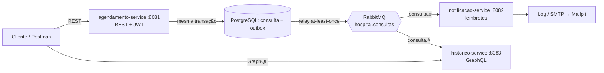
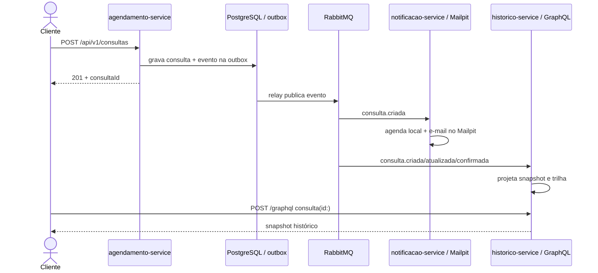

# Hospital Scheduling — Tech Challenge Fase 3

Sistema de agendamento e histórico de consultas hospitalares, construído como backend modular com foco em **segurança** e **comunicação assíncrona**.

> FIAP Pós Tech — Arquitetura e Desenvolvimento Java · Fase 03
> Autor: Gabriel Andrade Almeida

---

## Sumário

- [Início rápido](#início-rápido)
- [Credenciais de demonstração](#credenciais-de-demonstração)
- [URLs locais](#urls-locais)
- [Catálogo da API](#catálogo-da-api)
- [Collection Postman](#collection-postman)
- [Arquitetura em uma frase](#arquitetura-em-uma-frase)
- [Documentação](#documentação)
- [Gate de qualidade, auditoria e smoke](#gate-de-qualidade-auditoria-e-smoke-m10)

## Início rápido

Pré-requisitos: Docker com Compose v2, GNU Make, Bash, curl e jq 1.6 ou superior.
O caminho oficial sobe os seis containers, espera a saúde e executa a demonstração:

```bash
make demo
```

Depois, importe a collection descrita em [Collection Postman](#collection-postman) ou explore o
Swagger e o GraphiQL pelas URLs abaixo. `make down` encerra os containers preservando os dados;
`make reset` também apaga os volumes.

## Credenciais de demonstração

Os quatro usuários existem somente com o profile `demo` e usam a senha comum `Senha@123`.

| Perfil | E-mail |
|---|---|
| MEDICO | `medico@hospital.com` |
| ENFERMEIRO | `enfermeiro@hospital.com` |
| PACIENTE | `paciente@hospital.com` |
| PACIENTE (controle de propriedade) | `paciente2@hospital.com` |

## URLs locais

| Serviço | URL principal |
|---|---|
| Agendamento / Swagger | http://localhost:8081/swagger-ui.html |
| Notificação / health | http://localhost:8082/actuator/health |
| Histórico / GraphiQL | http://localhost:8083/graphiql |
| Mailpit | http://localhost:8025 |
| RabbitMQ Management | http://localhost:15672 |

## Catálogo da API

Todas as operações protegidas usam `Authorization: Bearer <accessToken>`. O token é emitido pelo
agendamento e validado pelos três serviços.

| Fronteira | Operação | Finalidade |
|---|---|---|
| REST | POST `/auth/login` | Autenticar e obter `accessToken`, `expiresIn` e `perfil` |
| REST | POST `/api/v1/consultas` | Criar consulta |
| REST | GET `/api/v1/consultas` | Listar consultas com filtros e paginação |
| REST | GET `/api/v1/consultas/{id}` | Buscar consulta |
| REST | PUT `/api/v1/consultas/{id}` | Alterar consulta |
| REST | PATCH `/api/v1/consultas/{id}/confirmar` | Confirmar consulta |
| REST | PATCH `/api/v1/consultas/{id}/cancelar` | Cancelar consulta com motivo |
| Interna | POST `/internal/lembretes/executar` | Disparar manualmente a varredura D-1 |
| GraphQL | `consultasDoPaciente(pacienteId:, filtro:)` | Histórico por paciente |
| GraphQL | `minhasConsultas(filtro:)` | Histórico do paciente autenticado |
| GraphQL | `consultasDoMedico(medicoId:, filtro:)` | Histórico por médico |
| GraphQL | `consulta(id:)` | Snapshot histórico por consulta |
| GraphQL | `corrigirRegistroHistorico(input:)` | Correção manual auditada pelo médico |

REST usa `http://localhost:8081`, o endpoint interno usa `http://localhost:8082` e GraphQL usa
`POST http://localhost:8083/graphql`. Os endpoints operacionais ficam descritos em
[Arquitetura verificada e observabilidade](#arquitetura-verificada-e-observabilidade-m11).

## Collection Postman

Importe no Postman os dois exports versionados:

- [`postman/Hospital-Scheduling-Fase3.postman_collection.json`](postman/Hospital-Scheduling-Fase3.postman_collection.json);
- [`postman/Hospital-Scheduling-Local.postman_environment.json`](postman/Hospital-Scheduling-Local.postman_environment.json).

Selecione o environment **Hospital Scheduling - Local** e execute a collection inteira no
**Collection Runner**, em ordem. Ela autentica os quatro perfis, cria e confirma uma consulta,
aguarda a projeção, corrige o histórico, prova 401/403/400/404/409/422 e cancela a consulta criada.
Tokens, identificadores e horários são variáveis efêmeras; nenhuma edição manual é necessária.

Com o ambiente de `make demo` saudável, a mesma collection pode ser executada pelo Newman oficial:

```bash
docker run --rm \
  --network hospital-fase3_hospital-net \
  --mount type=bind,source="$PWD/postman",target=/etc/newman,readonly \
  postman/newman:6.1.3-alpine run \
  /etc/newman/Hospital-Scheduling-Fase3.postman_collection.json \
  -e /etc/newman/Hospital-Scheduling-Local.postman_environment.json \
  --env-var agendamentoBaseUrl=http://agendamento:8081 \
  --env-var notificacaoBaseUrl=http://notificacao:8082 \
  --env-var historicoBaseUrl=http://historico:8083 --bail
```

## Status

🚧 Em desenvolvimento. Acompanhe o [roadmap](docs/04-roadmap.md).

## Arquitetura em uma frase

Três serviços Spring Boot — **agendamento** (escrita, REST, Clean Architecture), **notificações** (lembretes) e **histórico** (leitura, GraphQL) — integrados por eventos no **RabbitMQ**, com autenticação JWT e autorização por perfil.





## Stack

Java 21 · Spring Boot 3.5 · Spring Security + JWT · Spring for GraphQL · Spring AMQP + RabbitMQ · PostgreSQL 16 + Flyway · Testcontainers · ArchUnit · JaCoCo · Docker Compose

## Documentação

| Documento | Conteúdo |
|---|---|
| [Project Charter](docs/00-project-charter.md) | Escopo, papéis, decisões, Definition of Done |
| [Arquitetura](docs/01-arquitetura.md) | Visão geral, estrutura, Clean Architecture, segurança |
| [Especificação Funcional](docs/02-especificacao-funcional.md) | RF/RNF rastreáveis, matriz de autorização, modelo de dados |
| [Contrato de Eventos](docs/03-contrato-de-eventos.md) | Topologia RabbitMQ, envelope, outbox, idempotência |
| [Roadmap](docs/04-roadmap.md) | 15 changes com escopo, notas técnicas e critérios de aceite |
| [Fluxo de Trabalho](docs/05-fluxo-de-trabalho.md) | Ciclo OpenSpec + GitFlow, releases, convenção de commits |
| [ADRs](docs/adr/) | Decisões arquiteturais |
| [`openspec/config.yaml`](openspec/config.yaml) | Contexto e regras injetados em todo planejamento OpenSpec |
| [`openspec/specs/`](openspec/specs/) | O que já está construído, por capability |
| [`openspec/changes/`](openspec/changes/) | Propostas em andamento |

## Construir o projeto

Requisitos: **JDK 21** e **Maven 3.9+**.

```bash
mvn clean verify
```

O POM pai centraliza a versão de todos os módulos na propriedade `revision` — subir a versão
do projeto inteiro é alterar uma linha. O `flatten-maven-plugin` resolve esse placeholder nos
POMs publicados, gerando um `.flattened-pom.xml` por módulo (ignorado pelo Git).

Testes são separados por convenção de nome:

| Comando | O que roda |
|---|---|
| `mvn test` | apenas `*Test.java` (surefire) — unitários, rápidos, sem container |
| `mvn verify` | `*Test.java` **e** `*IT.java` (failsafe) — inclui integração com Testcontainers |

## Gate de qualidade, auditoria e smoke (M10)

### Gate global

O gate é um único comando na raiz, **sem filtro de teste**:

```bash
mvn -q clean verify
```

O reactor tem sete projetos: a raiz, os cinco módulos de código e o módulo técnico
`quality-gates`, construído por último. Sem aplicação e sem Spring, ele roda na fase `verify`,
nesta ordem:

1. **relatório agregado** do JaCoCo dos cinco módulos, em
   `quality-gates/target/site/jacoco-aggregate/index.html`, com o `jacoco.xml` ao lado;
2. **auditoria de execução**, que imprime suítes, relatórios e casos por módulo;
3. **gate de cobertura**, por linhas: **85%** global e **90%** em `agendamento/domain` e em
   `agendamento/application`. Os pisos não são rebaixados, e código não é excluído para
   alcançá-los.

A **sessão de verificação** amarra as três etapas ao build corrente. Na fase `initialize` do
projeto raiz, ela apaga as evidências anteriores: `jacoco.exec`, relatórios do surefire e do
failsafe e o relatório agregado. Depois grava o identificador da sessão em
`target/sessao-de-verificacao/sessao.txt`. A auditoria e o gate só aceitam esse marcador. Um
relatório residual de outro build não passa, e qualquer build Maven que inclua a raiz — como o do
smoke — recomeça a sessão.

A **auditoria** confere a evidência por suíte e por família de relatórios `TEST-*.xml` —
externa e aninhadas, por nome binário. Ela recusa:
- filtro de seleção por parâmetro (`-Dtest`, `-Dit.test`, includes e excludes, `groups`,
  motores, `dependenciesToScan`);
- omissão (`skipTests`, `skipITs`, `maven.test.skip`) e tolerância (`maven.test.failure.ignore`,
  `rerunFailingTestsCount`, `skipAfterFailureCount`);
- os mesmos mecanismos declarados nos POMs e perfis, inclusive por alias sobrescrevível pela
  linha de comando;
- parâmetros do JUnit Platform que não executam testes;
- `@Disabled`, condições e suposições no código de teste, e caso `skipped`.

O limite é explícito: a soma de casos não prova a execução de cada método. A garantia vem da
recusa desses mecanismos. Para iterar sem acionar os gates globais, use as suítes dirigidas:

```bash
mvn -q -pl shared-contracts,agendamento-service,notificacao-service,historico-service -am verify \
  -Dtest='FixtureCanonicaTest,FixtureCompartilhadaTest,ComparacaoComFixtureTest,InventarioDaSuperficieTest,InventarioGraphqlTest' \
  -Dit.test='CompatibilidadeDoProdutorComFixtureIT,ConsumoDaFixture*IT,EntradasHostisIT,EntradasHostisGraphqlIT,SuperficieHttpNotificacaoIT,InfraestruturaReal*IT' \
  -Dsurefire.failIfNoSpecifiedTests=false -Dfailsafe.failIfNoSpecifiedTests=false
```

```bash
mvn -q -pl quality-gates -am test \
  -Dtest='SessaoDeVerificacaoTest,AgregacaoDoReactorTest,ExclusoesDeCoberturaTest,VerificadorDeCoberturaTest,AuditoriaDeExecucaoTest,InfraestruturaRealTest,RoteiroDeSmokeTest' \
  -Dsurefire.failIfNoSpecifiedTests=false
```

A **infraestrutura real** também é verificada. O `InfraestruturaRealTest` recusa, nos `*IT` e
nas bases e configurações que eles alcançam:
- dublê de fonte de dados, JDBC, gerenciador de entidades, repositório, fábrica de conexões ou
  template AMQP;
- banco em memória, broker embarcado e `replace` diferente de `NONE`;
- imagem diferente de `postgres:16` e `rabbitmq:3.13-management`.

Espião, decorador e dublê de porta externa continuam permitidos. Cada módulo com container
comprova em runtime a infraestrutura que usa — e só ela — num `InfraestruturaReal*IT`:
PostgreSQL 16 e RabbitMQ 3.13 nos três serviços, só RabbitMQ no `shared-contracts`.

### Fixture canônica do contrato

`shared-contracts/src/test/resources/evento-consulta.json` é a **única cópia** do exemplar do
envelope. O `shared-contracts` a publica num test-jar (`classifier` `tests`) que contém apenas o
JSON, e os três serviços dependem dele em escopo `test`:
- o produtor compara com o exemplar a mensagem que chegou pelo broker real;
- cada consumidor processa os bytes exatos do exemplar pelo RabbitMQ real.

Não copie o arquivo para um serviço: o `FixtureCanonicaTest` e o `FixtureCompartilhadaTest`
recusam segunda cópia e sombreamento.

### Smoke ponta a ponta

```bash
scripts/smoke-test.sh
```

O roteiro não usa Compose nem imagens das aplicações, e não depende de estado prévio.

**Pré-requisitos**, conferidos antes de criar qualquer recurso: Bash 4 ou superior (no Windows,
o Git Bash), Docker com o daemon acessível, Java 21, Maven, curl e jq 1.6 ou superior.

O jq é pré-requisito **só do smoke real**. O `mvn -q clean verify` e o `RoteiroDeSmokeTest` não
dependem dele: os testes do roteiro injetam um jq controlado por `JQ_BIN`. Para apontar outro
executável no smoke, use `JQ_BIN=/caminho/do/jq scripts/smoke-test.sh`; o padrão é `jq`.

**O que ele faz, em ordem:**
1. um build único,
   `mvn -q -DskipTests package -pl agendamento-service,notificacao-service,historico-service -am`,
   que precisa deixar exatamente um `*-exec.jar` por serviço;
2. PostgreSQL 16 e RabbitMQ 3.13 efêmeros, com portas dinâmicas em `127.0.0.1` e credenciais
   aleatórias;
3. os três serviços como processos `java -jar`, com porta atribuída pelo sistema e o mesmo
   `JWT_SECRET` aleatório — o agendamento com os profiles `demo,docker`, a notificação e o
   histórico com `docker`, portanto com logs JSON;
4. login do médico do seed de demonstração;
5. criação de uma consulta a 30 dias, com observação `smoke-<RUN_ID>` e
   `X-Correlation-Id: smoke-<RUN_ID>`, conferido no header da resposta;
6. o registro JSON "Evento publicado" do relay no log do agendamento, com a consulta e o mesmo
   `correlationId`;
7. a notificação comprovada pelo registro persistido e pelo registro JSON do canal de log com o
   mesmo conteúdo e o mesmo `correlationId`;
8. a mesma consulta lida no histórico por GraphQL, e o registro JSON "Evento projetado" com o
   mesmo `correlationId`.

Cada registro de log é identificado pela consulta da execução e precisa ter `@timestamp`,
`level`, `logger_name`, `message` e `service`. Registro com outro `correlationId` termina com
código 1; registro ausente no prazo, com código 3.

Toda espera é condicional, com prazo absoluto.

| Código | Situação |
|---|---|
| 0 | sucesso |
| 1 | verificação divergente |
| 2 | pré-requisito ausente |
| 3 | prazo esgotado |
| 4 | processo do roteiro encerrado |
| 5 | limpeza incompleta |
| 130 / 143 | interrupção por SIGINT / SIGTERM |

**Recursos criados e removidos.** Cada execução tem um `RUN_ID` e cria:
- o diretório de runtime `${TMPDIR:-/tmp}/hospital-smoke.XXXXXXXX`;
- a rede, os dois containers e os dois volumes `hospital-smoke-<RUN_ID>…`, todos com o label
  `br.com.fiap.hospital.smoke=<RUN_ID>`;
- os três processos dos serviços.

Tudo é removido ao final — em sucesso, falha ou interrupção:
- processos só depois de confirmados como da execução, nunca por nome;
- containers e rede por nome exato, depois de conferido o valor completo do label.

Qualquer resíduo termina com código 5. `hospital-postgres`, `hospital-rabbitmq`, seus volumes e
qualquer outro recurso não são tocados.

**Diagnóstico.** Em falha, ou com `SMOKE_MANTER_LOGS=1`, os logs dos serviços e dos containers,
a última resposta e a etapa vão para `${TMPDIR:-/tmp}/hospital-smoke-diagnostico-<RUN_ID>/`, com
token, segredo e senhas mascarados. O caminho é impresso. O pacote não é recurso de runtime e
fica para você apagar.

Execuções **consecutivas** são independentes. Execuções **simultâneas no mesmo checkout não são
suportadas**: o build único escreve nos mesmos `target/`.

## Arquitetura verificada e observabilidade (M11)

### Fronteiras da Clean Architecture

O `ArquiteturaDoAgendamentoTest` roda no `mvn test` do `agendamento-service` e reprova o build
quando uma fronteira é cruzada: direção `domain ← application ← infrastructure`, domínio sem
Spring, JPA, Jackson ou Validation, um único método público `executar` por `*UseCase`, entidades
JPA só em `infrastructure.persistence`, controllers só com os casos de uso transacionais e nenhum
acesso à saída padrão. A única exceção é nominal: o `JwtService` no `AutenticacaoController`,
porque a emissão do token pertence à fronteira HTTP ([ADR-007](docs/adr/ADR-007-clean-architecture-so-no-core.md)).

### Correlação ponta a ponta

Os três serviços honram `X-Correlation-Id` não vazio, geram um UUID na ausência e devolvem o valor
no header — inclusive em 401 e 403, junto do `correlationId` do Problem Detail. O agendamento
grava o id no outbox e no envelope; a notificação e o histórico o restauram no contexto de log
durante o consumo. Um fluxo iniciado por uma criação de consulta aparece com o mesmo
`correlationId` nos três logs.

### Endpoints operacionais

| Endpoint | Acesso |
|---|---|
| `/actuator/health` (e subcaminhos) | público, só `{"status":...}`, sem detalhes |
| `/actuator`, `/actuator/info`, `/actuator/metrics`, `/actuator/prometheus` | token válido de qualquer perfil; sem token, 401 |
| qualquer outro, como `env` e `beans` | não exposto e negado, mesmo com token |

O `health` do agendamento não depende do RabbitMQ, porque o outbox mantém a API disponível sem
broker ([ADR-006](docs/adr/ADR-006-transactional-outbox.md)); o da notificação não depende de SMTP,
porque o canal padrão é o log.

### Logs JSON no profile `docker`

Com `SPRING_PROFILES_ACTIVE` contendo `docker`, cada serviço escreve no console um objeto JSON
por linha, no formato `logstash` nativo do Spring Boot: `@timestamp`, `level`, `logger_name`,
`message`, `service` e cada valor do contexto de log como campo próprio, como `correlationId`.
Sem o profile, o log continua em texto.

Suítes dirigidas do M11:

```bash
mvn -q -pl shared-security,agendamento-service,notificacao-service,historico-service -am verify \
  -Dtest='ArquiteturaDoAgendamentoTest,CorrelationIdFilterTest,SegurancaAutoConfigurationTest' \
  -Dit.test='CorrelacaoHttpIT,CorrelacaoHistoricoIT,CorrelacaoNotificacaoIT,ConsumoNotificacaoRabbitMqIT,ConsumoHistoricoRabbitMqIT,OutboxRelayIT,EndpointsOperacionaisIT,CadeiaDeSegurancaIT' \
  -Dsurefire.failIfNoSpecifiedTests=false -Dfailsafe.failIfNoSpecifiedTests=false
```

```bash
mvn -q -pl quality-gates -am test -Dtest='LogsEstruturadosTest,RoteiroDeSmokeTest,AuditoriaDeExecucaoTest,InfraestruturaRealTest' -Dsurefire.failIfNoSpecifiedTests=false
```

## Executar a infraestrutura

Para subir somente PostgreSQL 16 e RabbitMQ 3.13 e executar os serviços no host:

```bash
cp .env.example .env
make infra
# equivalente:
docker compose up -d postgres rabbitmq
```

Aguarde os dois containers ficarem `healthy`:

```bash
docker compose ps
```

| Recurso | Endereço | Credenciais padrão |
|---|---|---|
| PostgreSQL | `localhost:5432` | `hospital` / `hospital` |
| RabbitMQ (AMQP) | `localhost:5672` | `hospital` / `hospital` |
| RabbitMQ Management | http://localhost:15672 | `hospital` / `hospital` |

Portas e credenciais vêm do `.env` — se a 5432 ou a 5672 já estiverem ocupadas na sua máquina,
altere `POSTGRES_PORT` / `RABBITMQ_PORT` ali, sem tocar no `docker-compose.yml`.

### ⚠️ O `init.sql` só roda com o volume vazio

Os três databases — `agendamento_db`, `notificacao_db` e `historico_db` — são criados por
[`docker/postgres/init.sql`](docker/postgres/init.sql), montado em `/docker-entrypoint-initdb.d/`.

O entrypoint do Postgres **só executa esse diretório quando o volume de dados está vazio**.
Depois do primeiro boot, editar o `init.sql` não tem efeito nenhum: um `docker compose restart`
ou um `docker compose down` seguido de `up` reaproveitam o volume e ignoram o script.

Para reprovisionar do zero é preciso descartar o volume:

```bash
docker compose down -v && docker compose up -d
```

O `-v` é a diferença entre "reiniciei o ambiente" e "recriei o ambiente". Sem ele, uma alteração
no `init.sql` fica invisível e rende uma hora de depuração à toa.

Conferir que os três databases existem:

```bash
docker exec hospital-postgres psql -U hospital -d postgres -c "\l"
```

### Derrubar

```bash
docker compose down      # para os containers, preserva os dados
docker compose down -v   # remove também os volumes — apaga tudo
```

## Executar o serviço de agendamento

Com a infraestrutura no ar e o `.env` preenchido:

```bash
mvn -pl agendamento-service -am spring-boot:run
```

O schema do `agendamento_db` é criado pelo **Flyway**, nunca pelo Hibernate: o
`ddl-auto` está em `validate`, então a aplicação confere o mapeamento contra o banco
e **recusa subir** se divergirem.

### Quando a subida falha por schema divergente

`SchemaManagementException` ou falha de validação do Flyway significa que o banco está
num estado que as migrations não descrevem — quase sempre por ter sido criado por uma
versão anterior do schema. Como não há dado que importe até o M04, o caminho é
recriar:

```bash
docker compose down -v && docker compose up -d
```

Alterar uma migration já aplicada **não** resolve: o Flyway compara o checksum e falha
de novo. Migration aplicada é imutável; correção é migration nova.

### Testes de integração

Os testes `*IT` sobem um PostgreSQL real via Testcontainers e exigem Docker no ar:

```bash
mvn verify
```

Se o Testcontainers não encontrar o Docker mesmo com o daemon rodando, verifique se
`~/.testcontainers.properties` não fixa uma `docker.client.strategy` apontando para um
endpoint que a sua instalação não expõe — remover essa linha faz o Testcontainers
autodescobrir de novo.

## Usar a API

Com o serviço no ar, a documentação interativa fica em **http://localhost:8081/swagger-ui.html**,
e a especificação em `/v3/api-docs`.

| Endpoint | Método | O que faz |
|---|---|---|
| `/api/v1/consultas` | POST | Registra uma consulta. Responde `201` com `Location` |
| `/api/v1/consultas/{id}` | PUT | Altera. **Campo ausente preserva o valor atual** |
| `/api/v1/consultas/{id}/confirmar` | PATCH | Leva a consulta a `CONFIRMADA` |
| `/api/v1/consultas/{id}/cancelar` | PATCH | Cancela, com motivo obrigatório |
| `/api/v1/consultas/{id}` | GET | Recupera pelo identificador |
| `/api/v1/consultas` | GET | Lista paginado, com filtros opcionais |

A listagem aceita `pacienteId`, `medicoId`, `status`, `de`, `ate`, `pagina` e `tamanho`.
O tamanho de página tem **teto de 100**: um pedido maior é aparado, não recusado, e o
campo `tamanho` da resposta informa o valor aplicado.

Erros seguem RFC 7807, com `correlationId` e `timestamp`. Enviar `X-Correlation-Id` na
requisição preserva o seu identificador na resposta e no log.

### Autenticação

Todos os endpoints sob `/api/**` exigem um token. São públicos apenas `POST /auth/login`,
`/actuator/health`, `/v3/api-docs` e o Swagger UI. Qualquer outro caminho é negado por
padrão — rota nova que ninguém liberou fica inacessível, o que é falha visível em vez de
brecha.

```bash
curl -s -X POST http://localhost:8081/auth/login \
  -H 'Content-Type: application/json' \
  -d '{"email":"medico@hospital.com","senha":"Senha@123"}'
```

A resposta traz `accessToken`, `expiresIn` e `perfil`. Use o `accessToken` como `Bearer` nas
demais chamadas:

```bash
curl -s http://localhost:8081/api/v1/consultas \
  -H "Authorization: Bearer $TOKEN"
```

No Swagger UI, o botão **Authorize** aceita o token e o aplica a todas as operações.

O segredo de assinatura vem de `JWT_SECRET`, lido do ambiente. A aplicação **não sobe**
com o segredo ausente ou com menos de 32 bytes — falha na partida em vez de assinatura
fraca em produção. O token vale 8 horas e não é revogável; o porquê está em
[ADR-005](docs/adr/ADR-005-jwt-stateless.md).

### Quem pode o quê

| Endpoint | Método | MEDICO | ENFERMEIRO | PACIENTE |
|---|---|:---:|:---:|:---:|
| `/auth/login` | POST | público | público | público |
| `/api/v1/consultas` | POST | ✅ | ✅ | ❌ 403 |
| `/api/v1/consultas/{id}` | PUT | ✅ | ✅ | ❌ 403 |
| `/api/v1/consultas/{id}/cancelar` | PATCH | ✅ | ✅ | ❌ 403 |
| `/api/v1/consultas/{id}/confirmar` | PATCH | ✅ | ✅ | ✅ (só a própria) |
| `/api/v1/consultas/{id}` | GET | ✅ | ✅ | ✅ (só a própria) |
| `/api/v1/consultas` | GET | ✅ | ✅ | ✅ (filtro forçado ao próprio id) |

O `pacienteId` que um paciente enviar na listagem é **descartado** e substituído pelo
dele: recorte é permissão, não filtro. A tabela normativa vive em
[docs/02-especificacao-funcional.md](docs/02-especificacao-funcional.md) §3 e é lida em
tempo de execução pelos testes — acrescentar uma linha lá produz três casos que falham até
serem implementados ([ADR-004](docs/adr/ADR-004-matriz-de-autorizacao.md)).

Recusas seguem o mesmo contrato de erro do resto da API: **401** para credencial ausente
ou inválida, **403** para perfil sem permissão, com `type` distinto e `correlationId`. O
detalhe é fixo por categoria e não diz o que faltou — "token expirado" informaria que o
token já foi válido.

### Credenciais de demonstração

Com o profile `demo` ativo (`SPRING_PROFILES_ACTIVE=demo`), uma migration carrega quatro
usuários, todos com a senha `Senha@123`:

| Perfil | E-mail |
|---|---|
| MEDICO | `medico@hospital.com` |
| ENFERMEIRO | `enfermeiro@hospital.com` |
| PACIENTE | `paciente@hospital.com` |
| PACIENTE (segundo, para ver o 403 de propriedade) | `paciente2@hospital.com` |

> **Sem o profile `demo`, nenhum desses usuários existe.** O seed vive em
> `db/demo`, um diretório que só entra em `spring.flyway.locations` sob esse profile —
> não é uma migration desabilitada por condicional, é um arquivo que o Flyway nem
> enxerga. As senhas estão no repositório apenas como hash BCrypt.

## Executar a aplicação completa

O caminho oficial da demonstração exige **Docker com Compose v2, GNU Make, Bash, curl e jq
1.6+**. Na primeira execução, o comando cria o `.env` a partir do exemplo quando necessário,
constrói as três imagens, espera os seis containers ficarem saudáveis e comprova o fluxo real:
login, criação de consulta, e-mail de agendamento, histórico GraphQL e lembrete D-1.
No Windows, use o Git for Windows instalado no caminho padrão; o Makefile seleciona o Git Bash
explicitamente para não cair no launcher do WSL encontrado em `System32`.

```bash
make demo
```

Sem Make, estes três comandos são apenas uma conveniência operacional; a evidência oficial do
projeto continua sendo `make demo`:

```bash
cp .env.example .env
docker compose up -d --build --wait
bash scripts/demo.sh
```

| Serviço | URL |
|---|---|
| Agendamento (Swagger) | http://localhost:8081/swagger-ui.html |
| Notificações | http://localhost:8082/actuator/health |
| Histórico (GraphiQL) | http://localhost:8083/graphiql |
| Mailpit | http://localhost:8025 |
| RabbitMQ Management | http://localhost:15672 |

Usuários de demonstração: `medico@hospital.com`, `enfermeiro@hospital.com` e
`paciente@hospital.com`; senha comum: `Senha@123`. O roteiro usa o enfermeiro e informa ao final
o `consultaId`, a origem da consulta (`criada` ou `reaproveitada`) e os identificadores dos e-mails.

Operação cotidiana:

```bash
make ps      # estado dos containers
make logs    # logs agregados
make down    # encerra, preservando os volumes
make reset   # encerra e apaga os volumes e seus dados
```

> **Atenção:** `make reset` e qualquer `docker compose down -v` apagam os bancos e as filas do
> ambiente local. `make demo` não remove dados e pode ser reexecutado sem duplicar a consulta de
> demonstração enquanto ela estiver na janela das próximas 24 horas.

## Metodologia

Desenvolvido com **Spec-Driven Development via [OpenSpec](https://github.com/Fission-AI/OpenSpec)** e três papéis: Gabriel como Product Owner e revisor, Claude (chat) como gestor de projeto e engenheiro de prompt, Claude Code como engenheiro de software. Nenhum código sem proposta aprovada.

Cada uma das 15 changes do roadmap segue o ciclo `/opsx:propose` → revisão humana → `/opsx:apply` → PR → `/opsx:archive`, numa branch `feature/` própria.

## Fluxo de branches

**GitFlow completo** — `feature/` → `develop` → `release/` → `main`, com merges `--no-ff` e tags em todas as releases. Detalhes em [docs/05-fluxo-de-trabalho.md](docs/05-fluxo-de-trabalho.md).

| Release | Fecha após | Entrega |
|---|---|---|
| `v0.1.0` | M04 | Agendamento seguro ponta a ponta |
| `v0.2.0` | M07 | Mensageria, notificações, histórico e lembrete D-1 |
| `v1.0.0` | M14 | Entrega do Tech Challenge |

## Licença

MIT

## Consulta do histórico por GraphQL (M09)

O endpoint é `POST /graphql` e **exige token** — o mesmo JWT emitido por
`POST /auth/login` no agendamento. O histórico não tem login próprio.

```bash
TOKEN=$(curl -s -X POST http://localhost:8081/auth/login   -H 'Content-Type: application/json'   -d '{"email":"medico@hospital.com","senha":"Senha@123"}' | jq -r .accessToken)
```

Consultas disponíveis: `consultasDoPaciente(pacienteId:, filtro:)`,
`consultasDoMedico(medicoId:, filtro:)`, `consulta(id:)` e `minhasConsultas(filtro:)` —
esta última exclusiva do perfil PACIENTE, que resolve a identidade do token e não aceita
identificador como argumento.

```bash
curl -s -X POST http://localhost:8083/graphql   -H "Authorization: Bearer $TOKEN" -H 'Content-Type: application/json'   -d '{"query":"query($p:ID!){ consultasDoPaciente(pacienteId:$p, filtro:{periodo:FUTURAS, status:[AGENDADA,CONFIRMADA]}) { id dataHora status medicoNome } }","variables":{"p":"<pacienteId>"}}'
```

O filtro combina período, intervalo e status por AND. `TODAS` não recorta pelo relógio;
`FUTURAS` é `dataHora >= agora` e `PASSADAS` é `dataHora < agora`; o intervalo é `[de, ate)`,
com `de` inclusivo e `ate` exclusivo. Lista de status vazia não restringe. O resultado vem
ordenado por `dataHora` e, no empate, por `id`.

A correção de registro é exclusiva de MEDICO:

```bash
curl -s -X POST http://localhost:8083/graphql   -H "Authorization: Bearer $TOKEN" -H 'Content-Type: application/json'   -d '{"query":"mutation($in:CorrigirRegistroHistoricoInput!){ corrigirRegistroHistorico(input:$in){ id status observacoes atualizadoEm } }","variables":{"in":{"consultaId":"<id>","justificativa":"status registrado por engano","status":"AGENDADA"}}}'
```

`consultaId` apenas seleciona o registro. **Não existem** campos para autor, `pacienteId`
ou `medicoId`: o autor vem do token, e os identificadores não são corrigíveis — enviá-los é
recusado com `BAD_REQUEST` antes de a operação executar. Campo ausente não corrige; nulo
explícito só é aceito em `observacoes`, onde limpa o registro. Toda correção grava, na mesma
transação, uma linha `CORRECAO_MANUAL` em `consulta_evento` com médico autor, justificativa e
os valores antes e depois — se a auditoria falhar, a correção não vale.

Erros saem com código estável em `extensions.code`: `FORBIDDEN`, `NOT_FOUND` e `BAD_REQUEST`.
Falha inesperada devolve mensagem genérica, sem SQL nem stack trace.

**GraphiQL** responde em `/graphiql` apenas nos profiles `dev` e `demo`; no profile padrão a
interface fica desabilitada e o caminho é negado pela cadeia de segurança.

## Operação das notificações (M06)

O `notificacao-service` consome `notificacao.consultas` e, na mesma transação, atualiza a
`agenda_local`, envia a notificação reativa quando aplicável e grava a auditoria, marcando o
`eventId` por último. Criação, atualização e cancelamento notificam; confirmação e realização
apenas atualizam a agenda. Fato com `occurredAt` anterior ao já aplicado é marcado como
processado sem regredir a agenda nem enviar aviso desatualizado.

O canal de envio é escolhido por `NOTIFICACAO_SENDER`, com padrão `log` — sem configuração,
nenhum provedor externo é contactado. O adaptador SMTP lê `SMTP_HOST`, `SMTP_PORT` e
`NOTIFICACAO_REMETENTE` do ambiente; não há credencial no repositório.

**Garantia:** o efeito persistido é exatamente-uma-vez por `eventId`. O envio externo é
ao-menos-uma-vez: existe uma janela em que o canal recebe a mensagem e a transação reverte.
Por isso `notificacao_enviada` registra o que transações confirmadas produziram, e não todo
envio realizado — não use essa tabela como prova absoluta de que um paciente foi avisado.

Rollback: parar o consumidor e preservar banco, fila, DLQ, agenda e auditoria; retomar após a
correção, sem apagar marcas processadas.

## Lembrete D-1 (M07)

O `notificacao-service` avisa o paciente na véspera. A varredura D-1 lê a `agenda_local` e
lembra cada consulta `AGENDADA` ou `CONFIRMADA` cujo horário esteja em `(agora, agora + 24h]` —
estritamente no futuro e até 24 horas à frente, inclusive. `CANCELADA` e `REALIZADA` nunca
recebem lembrete. O horário no texto sai no fuso `America/Sao_Paulo`.

**Cadência.** Um job executa a varredura no início de cada hora. A expressão vem de
`NOTIFICACAO_LEMBRETE_CRON` (cron do Spring, padrão `0 0 * * * *`), e
`NOTIFICACAO_LEMBRETE_AGENDADOR_HABILITADO=false` desliga o job sem desligar o consumidor nem o
endpoint. No profile `test` o job não existe.

**Um lembrete por consulta, durante toda a vida dela.** A regra é garantida por unicidade no
PostgreSQL, com a reserva do registro feita antes do envio: execuções concorrentes — o job e o
disparo manual, ou duas instâncias — entregam um único lembrete. Consulta remarcada depois de
lembrada **não** recebe outro; o aviso de alteração do M06 informa o novo horário. Se o canal
falhar, nada fica registrado e a próxima execução tenta de novo, e a falha de uma consulta não
impede as demais.

**Garantia:** o efeito persistido é no máximo um lembrete por consulta. O envio externo é
ao-menos-uma-vez numa janela: se o canal recebe a mensagem e a confirmação da transação falha,
a execução seguinte reenvia.

### Disparo manual

`POST /internal/lembretes/executar` executa a varredura na hora — é o que permite demonstrar o
lembrete sem esperar a hora cheia. Exige o mesmo JWT emitido por `POST /auth/login` no
agendamento.

| Situação | Resposta |
|---|---|
| MEDICO ou ENFERMEIRO | `200` com `{"lembretesEnviados": n}`, inclusive `0` |
| PACIENTE | `403` em Problem Detail, `type` `acesso-negado` |
| Token ausente, expirado ou inválido | `401` em Problem Detail, `type` `nao-autenticado` |
| Banco indisponível na leitura dos candidatos | `500` em Problem Detail, `type` `erro-interno`, com `correlationId` |

A célula de cada perfil está na matriz normativa de
[docs/02-especificacao-funcional.md](docs/02-especificacao-funcional.md) §3, e os testes a leem
de lá.

### Demonstração

O token é assinado pelo agendamento e validado pela notificação com o mesmo segredo. O
`notificacao-service` **não sobe sem `JWT_SECRET`** — não há valor padrão —, e nem o Maven nem
o Spring leem o `.env`. Exporte as variáveis em **cada** sessão de shell que sobe um serviço:

```bash
set -a; . ./.env; set +a
```

No primeiro terminal, o agendamento com os usuários de demonstração:

```bash
SPRING_PROFILES_ACTIVE=demo mvn -pl agendamento-service -am spring-boot:run
```

No segundo terminal, depois do mesmo `set -a; . ./.env; set +a`:

```bash
mvn -pl notificacao-service -am spring-boot:run
```

Crie uma consulta para as próximas 24 horas por `POST /api/v1/consultas` (ver
[Usar a API](#usar-a-api)); o evento chega à agenda local da notificação. Então dispare:

```bash
TOKEN=$(curl -s -X POST http://localhost:8081/auth/login -H 'Content-Type: application/json' -d '{"email":"medico@hospital.com","senha":"Senha@123"}' | jq -r .accessToken)
```

```bash
curl -s -X POST http://localhost:8082/internal/lembretes/executar -H "Authorization: Bearer $TOKEN"
```

A resposta é `{"lembretesEnviados":1}`, e o lembrete aparece no log da notificação — ou no
servidor SMTP, com `NOTIFICACAO_SENDER=smtp`. Um segundo disparo responde `0`: a consulta já foi
lembrada.

## Rollback do histórico (M08)

Para rollback, parar o consumidor do histórico e preservar banco, filas, DLQ, trilha e marcas de processamento. Após a correção, retomar o consumidor; não apagar evidências nem reenviar mensagens confirmadas.

## Operação dos eventos de consulta (M05)

O agendamento grava consulta e envelope na mesma transação. O relay publica lotes de até 50 a cada 1s após a conclusão do lote anterior. O histórico projeta os eventos em seu read model com idempotência transacional e trilha completa; a notificação mantém a agenda local e avisa o paciente.

Os três serviços leem RABBITMQ_HOST (localhost ao executar na máquina; rabbitmq na rede Compose), RABBITMQ_PORT, RABBITMQ_USER e RABBITMQ_PASSWORD. As propriedades de consumo exigem default-requeue-rejected=false e três tentativas totais, com pausas de 1s e 2s. A topologia é declarada na primeira conexão ao broker. Testes desabilitam o scheduler e acionam o relay explicitamente.

Uma falha de publicação mantém a linha pendente, sem teto de tentativas. Diagnóstico no agendamento_db:

```sql
SELECT count(*) AS pendentes, min(criado_em) AS fato_mais_antigo,
       max(tentativas) AS maior_numero_de_falhas
FROM outbox_evento WHERE publicado_em IS NULL;

SELECT id, tipo_evento, criado_em, tentativas
FROM outbox_evento WHERE publicado_em IS NULL
ORDER BY tentativas, criado_em, id LIMIT 50;
```

Verifique conectividade, exchange/bindings e rejeições de publicação no Management UI do RabbitMQ. Nas DLQs notificacao.consultas.dlq e historico.consultas.dlq, x-death identifica a origem; a topologia normativa encaminha cada rejeição para ambas. Não há purge, expiração ou reenvio automático. Corrigir a causa antes de uma eventual operação manual; reprocessamento exige consumidores idempotentes. O dead-letter worker pode aguardar até seu próximo intervalo de 180s após restaurar o destino.

V3 recusa sobreposições ativas preexistentes com mensagem em português e IDs/recurso: corrigir dados somente após análise humana, nunca desabilitar a exclusão. O seed V900 atual contém usuários/médico/pacientes, sem as cinco consultas descritas no roteiro de demonstração. Apenas o profile demo habilita Flyway out-of-order para aplicar V2/V3 depois de V900.

Datas persistidas preservam instantes. O envelope deriva o offset de America/Sao_Paulo na data da consulta e congela essa representação; não recupera o offset original. Falhas transitórias 40P01/40001 retornam o type alteração concorrente, distinto do conflito de agenda 23P01; o cliente relê e tenta novamente, sem retry automático do serviço.

Para uma parada operacional, desabilitar hospital.outbox.scheduler-enabled mantém as pendências. Migrations e dados permanecem; voltar à versão que só registrava eventos em log não mantém a garantia de publicação de fatos novos.

Ver [ADR-001](docs/adr/ADR-001-rabbitmq.md), [ADR-006](docs/adr/ADR-006-transactional-outbox.md) e [contrato normativo](docs/03-contrato-de-eventos.md).
