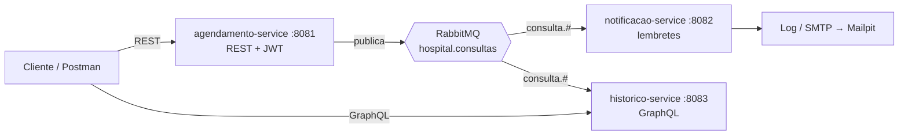

# Hospital Scheduling — Tech Challenge Fase 3

Sistema de agendamento e histórico de consultas hospitalares, construído como backend modular com foco em **segurança** e **comunicação assíncrona**.

> FIAP Pós Tech — Arquitetura e Desenvolvimento Java · Fase 03
> Autor: Gabriel Andrade Almeida

---

## Status

🚧 Em desenvolvimento. Acompanhe o [roadmap](docs/04-roadmap.md).

## Arquitetura em uma frase

Três serviços Spring Boot — **agendamento** (escrita, REST, Clean Architecture), **notificações** (lembretes) e **histórico** (leitura, GraphQL) — integrados por eventos no **RabbitMQ**, com autenticação JWT e autorização por perfil.



## Stack

Java 21 · Spring Boot 3.5 · Spring Security + JWT · Spring for GraphQL · Spring AMQP + RabbitMQ · PostgreSQL 16 + Flyway · Testcontainers · ArchUnit · JaCoCo · Docker Compose

## Documentação

| Documento | Conteúdo |
|---|---|
| [Project Charter](docs/00-project-charter.md) | Escopo, papéis, decisões, Definition of Done |
| [Arquitetura](docs/01-arquitetura.md) | Visão geral, estrutura, Clean Architecture, segurança |
| [Especificação Funcional](docs/02-especificacao-funcional.md) | RF/RNF rastreáveis, matriz de autorização, modelo de dados |
| [Contrato de Eventos](docs/03-contrato-de-eventos.md) | Topologia RabbitMQ, envelope, outbox, idempotência |
| [Roadmap](docs/04-roadmap.md) | 15 changes com escopo, notas técnicas e critérios de aceite |
| [Fluxo de Trabalho](docs/05-fluxo-de-trabalho.md) | Ciclo OpenSpec + GitFlow, releases, convenção de commits |
| [ADRs](docs/adr/) | Decisões arquiteturais |
| [`openspec/config.yaml`](openspec/config.yaml) | Contexto e regras injetados em todo planejamento OpenSpec |
| [`openspec/specs/`](openspec/specs/) | O que já está construído, por capability |
| [`openspec/changes/`](openspec/changes/) | Propostas em andamento |

## Como executar

> Preenchido no M12.

```bash
cp .env.example .env
docker compose up -d
./scripts/smoke-test.sh
```

| Serviço | URL |
|---|---|
| Agendamento (Swagger) | http://localhost:8081/swagger-ui.html |
| Notificações | http://localhost:8082/actuator/health |
| Histórico (GraphiQL) | http://localhost:8083/graphiql |
| RabbitMQ Management | http://localhost:15672 |
| Mailpit | http://localhost:8025 |

## Metodologia

Desenvolvido com **Spec-Driven Development via [OpenSpec](https://github.com/Fission-AI/OpenSpec)** e três papéis: Gabriel como Product Owner e revisor, Claude (chat) como gestor de projeto e engenheiro de prompt, Claude Code como engenheiro de software. Nenhum código sem proposta aprovada.

Cada uma das 15 changes do roadmap segue o ciclo `/opsx:propose` → revisão humana → `/opsx:apply` → PR → `/opsx:archive`, numa branch `feature/` própria.

## Fluxo de branches

**GitFlow completo** — `feature/` → `develop` → `release/` → `main`, com merges `--no-ff` e tags em todas as releases. Detalhes em [docs/05-fluxo-de-trabalho.md](docs/05-fluxo-de-trabalho.md).

| Release | Fecha após | Entrega |
|---|---|---|
| `v0.1.0` | M04 | Agendamento seguro ponta a ponta |
| `v0.2.0` | M09 | Mensageria, notificações e histórico GraphQL |
| `v1.0.0` | M14 | Entrega do Tech Challenge |

## Licença

MIT
