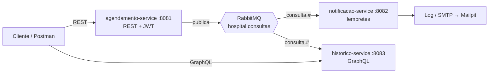

# Hospital Scheduling — Tech Challenge Fase 3

Sistema de agendamento e histórico de consultas hospitalares, construído como backend modular com foco em **segurança** e **comunicação assíncrona**.

> FIAP Pós Tech — Arquitetura e Desenvolvimento Java · Fase 03
> Autor: Gabriel Andrade Almeida

---

## Status

🚧 Em desenvolvimento. Acompanhe o [roadmap](docs/04-roadmap.md).

## Arquitetura em uma frase

Três serviços Spring Boot — **agendamento** (escrita, REST, Clean Architecture), **notificações** (lembretes) e **histórico** (leitura, GraphQL) — integrados por eventos no **RabbitMQ**, com autenticação JWT e autorização por perfil.



## Stack

Java 21 · Spring Boot 3.5 · Spring Security + JWT · Spring for GraphQL · Spring AMQP + RabbitMQ · PostgreSQL 16 + Flyway · Testcontainers · ArchUnit · JaCoCo · Docker Compose

## Documentação

| Documento | Conteúdo |
|---|---|
| [Project Charter](docs/00-project-charter.md) | Escopo, papéis, decisões, Definition of Done |
| [Arquitetura](docs/01-arquitetura.md) | Visão geral, estrutura, Clean Architecture, segurança |
| [Especificação Funcional](docs/02-especificacao-funcional.md) | RF/RNF rastreáveis, matriz de autorização, modelo de dados |
| [Contrato de Eventos](docs/03-contrato-de-eventos.md) | Topologia RabbitMQ, envelope, outbox, idempotência |
| [Roadmap](docs/04-roadmap.md) | 15 changes com escopo, notas técnicas e critérios de aceite |
| [Fluxo de Trabalho](docs/05-fluxo-de-trabalho.md) | Ciclo OpenSpec + GitFlow, releases, convenção de commits |
| [ADRs](docs/adr/) | Decisões arquiteturais |
| [`openspec/config.yaml`](openspec/config.yaml) | Contexto e regras injetados em todo planejamento OpenSpec |
| [`openspec/specs/`](openspec/specs/) | O que já está construído, por capability |
| [`openspec/changes/`](openspec/changes/) | Propostas em andamento |

## Construir o projeto

Requisitos: **JDK 21** e **Maven 3.9+**.

```bash
mvn clean verify
```

O POM pai centraliza a versão de todos os módulos na propriedade `revision` — subir a versão
do projeto inteiro é alterar uma linha. O `flatten-maven-plugin` resolve esse placeholder nos
POMs publicados, gerando um `.flattened-pom.xml` por módulo (ignorado pelo Git).

Testes são separados por convenção de nome:

| Comando | O que roda |
|---|---|
| `mvn test` | apenas `*Test.java` (surefire) — unitários, rápidos, sem container |
| `mvn verify` | `*Test.java` **e** `*IT.java` (failsafe) — inclui integração com Testcontainers |

## Executar a infraestrutura

Sobe PostgreSQL 16 e RabbitMQ 3.13, que é tudo que os serviços precisam para rodar localmente.
Os containers das três aplicações entram no M12.

```bash
cp .env.example .env
docker compose up -d
```

Aguarde os dois containers ficarem `healthy`:

```bash
docker compose ps
```

| Recurso | Endereço | Credenciais padrão |
|---|---|---|
| PostgreSQL | `localhost:5432` | `hospital` / `hospital` |
| RabbitMQ (AMQP) | `localhost:5672` | `hospital` / `hospital` |
| RabbitMQ Management | http://localhost:15672 | `hospital` / `hospital` |

Portas e credenciais vêm do `.env` — se a 5432 ou a 5672 já estiverem ocupadas na sua máquina,
altere `POSTGRES_PORT` / `RABBITMQ_PORT` ali, sem tocar no `docker-compose.yml`.

### ⚠️ O `init.sql` só roda com o volume vazio

Os três databases — `agendamento_db`, `notificacao_db` e `historico_db` — são criados por
[`docker/postgres/init.sql`](docker/postgres/init.sql), montado em `/docker-entrypoint-initdb.d/`.

O entrypoint do Postgres **só executa esse diretório quando o volume de dados está vazio**.
Depois do primeiro boot, editar o `init.sql` não tem efeito nenhum: um `docker compose restart`
ou um `docker compose down` seguido de `up` reaproveitam o volume e ignoram o script.

Para reprovisionar do zero é preciso descartar o volume:

```bash
docker compose down -v && docker compose up -d
```

O `-v` é a diferença entre "reiniciei o ambiente" e "recriei o ambiente". Sem ele, uma alteração
no `init.sql` fica invisível e rende uma hora de depuração à toa.

Conferir que os três databases existem:

```bash
docker exec hospital-postgres psql -U hospital -d postgres -c "\l"
```

### Derrubar

```bash
docker compose down      # para os containers, preserva os dados
docker compose down -v   # remove também os volumes — apaga tudo
```

## Executar a aplicação completa

> Preenchido no M12.

| Serviço | URL |
|---|---|
| Agendamento (Swagger) | http://localhost:8081/swagger-ui.html |
| Notificações | http://localhost:8082/actuator/health |
| Histórico (GraphiQL) | http://localhost:8083/graphiql |
| Mailpit | http://localhost:8025 |

## Metodologia

Desenvolvido com **Spec-Driven Development via [OpenSpec](https://github.com/Fission-AI/OpenSpec)** e três papéis: Gabriel como Product Owner e revisor, Claude (chat) como gestor de projeto e engenheiro de prompt, Claude Code como engenheiro de software. Nenhum código sem proposta aprovada.

Cada uma das 15 changes do roadmap segue o ciclo `/opsx:propose` → revisão humana → `/opsx:apply` → PR → `/opsx:archive`, numa branch `feature/` própria.

## Fluxo de branches

**GitFlow completo** — `feature/` → `develop` → `release/` → `main`, com merges `--no-ff` e tags em todas as releases. Detalhes em [docs/05-fluxo-de-trabalho.md](docs/05-fluxo-de-trabalho.md).

| Release | Fecha após | Entrega |
|---|---|---|
| `v0.1.0` | M04 | Agendamento seguro ponta a ponta |
| `v0.2.0` | M09 | Mensageria, notificações e histórico GraphQL |
| `v1.0.0` | M14 | Entrega do Tech Challenge |

## Licença

MIT
